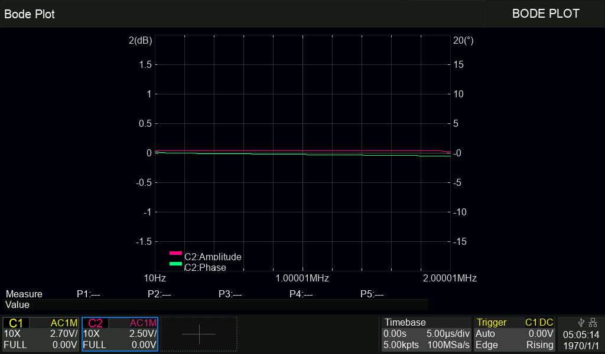

# espBode

`espBode` is compact ESP-01 / ESP8266 firmware that allows a Siglent HD-series oscilloscope to use its Bode Plot workflow with an external FeelTech / FeelElec FY-series waveform generator over WiFi and TTL serial.

The firmware acts as a lightweight bridge and protocol adapter:
- on the oscilloscope side it exposes the RPC portmapper and VXI-11 services expected by Siglent AWG-over-LAN control
- on the generator side it translates the required SCPI control flow into FY-series UART/TTL commands

The implementation is designed for 1 MB ESP-01 hardware and keeps a small footprint, non-blocking network handling, persistent configuration, and optional diagnostic variants.

## What Problem It Solves

Siglent SDS800X-HD scopes expect a network-reachable AWG that speaks a specific RPC/VXI-11 control pattern. FY-series generators can be controlled over TTL serial, but they do not natively present the network services the scope expects.

This project bridges that gap with a single ESP-01:
- the scope talks to the ESP over WiFi/LAN
- the ESP emulates the required network-facing control flow
- the ESP drives the AWG over TTL serial

This avoids the need for a PC-hosted bridge, USB middleware, or a larger embedded platform.

## Validated And Expected Hardware

Validated reference setup:
- Siglent SDS824X HD
- FeelTech FY6900
- ESP-01 / ESP8266EX with 1 MB flash

Expected but not fully verified:
- other Siglent oscilloscope models
- FeelTech / FeelElec FY6600, FY6800, and FY6900 units using compatible TTL command formats

Generator compatibility outside the validated FY6900 setup should be treated as expected rather than guaranteed, especially for older FY firmware revisions.

## Architecture Summary

Oscilloscope side:
- UDP portmapper on port `111`
- TCP portmapper on port `111`
- VXI-11 core service on TCP `9009` / `9010`

ESP bridge side:
- non-blocking RPC/VXI session handling
- cached SCPI response behavior where needed for scope compatibility
- EEPROM-backed configuration with versioning and CRC validation
- built-in web configuration UI on port `80`

AWG side:
- UART0 TTL serial transport
- waveform, frequency, amplitude, offset, phase, and output control
- current implementation verified against later FY6900 frequency formatting

## Features

- WiFi STA operation with persistent settings
- immediate AP setup mode when no usable WiFi configuration is stored
- AP fallback for recovery when STA connection fails
- `/config` web interface for WiFi and runtime-related settings
- factory reset via `/reset`
- RPC/VXI-11 service pair required by Siglent Bode operation
- alternating VXI service ports to reduce reconnect issues
- protocol diagnostics in the dedicated diagnostic firmware variant
- UART console diagnostics in dedicated bench firmware variants

## WiFi Setup And First Boot Behavior

The public default configuration is intentionally sanitized and does not contain a preloaded WiFi SSID or password.

Current behavior:
- on first boot, if no valid stored configuration exists, the device starts its fallback AP immediately
- if configuration exists but WiFi settings are unusable, the device also ends up in AP mode without needing a reflash
- if valid WiFi settings are stored, the device attempts normal STA operation
- if STA connection fails, the existing fallback AP recovery behavior remains available

Fallback AP details:
- SSID: `ESP01`
- password: open network
- IP: `192.168.0.1`
- config page: `http://192.168.0.1/config`
- DHCP client range: `192.168.0.10` to `192.168.0.50`

Typical first access flow after flashing:
1. Power the ESP-01 normally.
2. If no working WiFi configuration is stored, connect to the `ESP01` access point.
3. Open `http://192.168.0.1/config`.
4. Enter the target WiFi settings and save.
5. The module reboots and retries in STA mode.

## `/config` Web Interface

The web UI is available in both STA mode and AP mode.

Routes:
- `GET /` redirects to `/config`
- `GET /config` shows the current configuration
- `POST /config` validates, saves, and reboots
- `GET /retry` reboots and retries WiFi
- `GET /reset` confirms and performs factory reset

Configurable fields with runtime effect:
- WiFi SSID and PSK
- DHCP or static IP settings
- STA hostname
- station MAC override
- AP MAC override
- `IDN Model Name` used for the `IDN-SGLT-PRI?` protocol reply

Stored but mainly informational fields:
- `Friendly Name`

Fixed behavior to be aware of:
- AWG UART baud is fixed at `115200` in the normal web configuration path
- invalid SSID, invalid PSK length, invalid IP tuples, and invalid MAC text are rejected
- MAC override changes apply after reboot

Factory reset note:
- `/reset` restores the compile-time defaults and reboots

## Diagnostic Firmware Variants

Available PlatformIO targets:
- `esp01_release`
- `esp01_diag_protocol`
- `esp01_diag_uart0`
- `esp01_diag_wifi`

Recommended normal firmware:
- `esp01_release`

Diagnostic variants:
- `esp01_diag_protocol`
  - keeps normal AWG operation enabled
  - exposes protocol diagnostics in the `/config` page
  - useful for VXI/RPC tracing while preserving the working control path
- `esp01_diag_uart0`
  - uses UART0 as a human-readable console
  - intended for bench work, not for simultaneous normal AWG operation on the same UART wiring
- `esp01_diag_wifi`
  - skips AWG initialization and focuses on WiFi diagnostics

Additional note:
- the raw `/diag` page for ad-hoc AWG command testing exists only when building with an extra `DEBUG_BUILD` define, not in the standard published PlatformIO targets

## Build Instructions

Prerequisites:
- Python 3.8+
- PlatformIO

Install PlatformIO:

```bash
pip install platformio
```

Build examples:

```bash
platformio run -e esp01_release
platformio run -e esp01_diag_protocol
platformio run -e esp01_diag_uart0
platformio run -e esp01_diag_wifi
```

Primary build outputs:

```text
.pio/build/esp01_release/firmware.bin
.pio/build/esp01_diag_protocol/firmware.bin
.pio/build/esp01_diag_uart0/firmware.bin
.pio/build/esp01_diag_wifi/firmware.bin
```

## Flashing Instructions

ESP-01 flashing wiring:

| USB-serial adapter | ESP-01 |
|---|---|
| 3.3 V | VCC and CH_PD / EN |
| GND | GND |
| TX | RX (GPIO3) |
| RX | TX (GPIO1) |
| GND during reset | GPIO0 |

To enter the bootloader:
1. Pull `GPIO0` low.
2. Power-cycle or reset the ESP-01.
3. Keep the wiring stable until flashing completes.
4. Release `GPIO0` and reboot normally afterwards.

Flash with PlatformIO:

```bash
platformio run -e esp01_release -t upload --upload-port <PORT>
platformio run -e esp01_diag_protocol -t upload --upload-port <PORT>
```

Flash with esptool:

```bash
python -m esptool --chip esp8266 --port <PORT> --baud 115200 --before default_reset --after hard_reset write_flash 0x0 .pio/build/esp01_release/firmware.bin
python -m esptool --chip esp8266 --port <PORT> --baud 115200 --before default_reset --after hard_reset write_flash 0x0 .pio/build/esp01_diag_protocol/firmware.bin
```

Replace `<PORT>` with the serial port provided by the USB-to-UART adapter.

## Basic Usage And Bench Setup

Normal use:
1. Flash `esp01_release`.
2. Connect the ESP-01 to the FY-series generator TTL serial header.
3. Power the module and complete WiFi setup via `http://192.168.0.1/config` if needed.
4. Put the oscilloscope and ESP on the same network.
5. On the scope, configure the generator connection as LAN and enter the ESP IP.
6. Run the Bode workflow normally.

Bench diagnosis:
1. Use `esp01_diag_protocol` when normal AWG control must remain active and you need protocol logs.
2. Use `esp01_diag_uart0` when you need an interactive UART console.
3. Use `esp01_diag_wifi` when WiFi initialization itself is under investigation.


## Test Wiring And Execution

Validated bench wiring for the Bode measurement:

1. Use generator `CH1` as the test source.
2. Connect generator `CH1` to a BNC `T` connector.
3. From the `T` connector, run two `50 Ω` coaxial cables:
   - one cable directly to oscilloscope `CH2` as the reference signal
   - the other cable through the circuit under test, then to oscilloscope `CH1`
4. Because the `SDS800X-HD` does not provide native `50 Ω` input termination, connect both oscilloscope channels through external `50 Ω` to `1 MΩ` adapter/termination arrangements.

Test execution notes:
- generator `CH2` should be disabled during the test to keep the signal path as clean as possible
- the test signal is enabled automatically while the measurement is running
- after the measurement is stopped, the test signal is turned off approximately one minute later

This wiring allows the oscilloscope to compare the direct reference path on `CH2` with the DUT response on `CH1` during the Bode sweep.

## SCPI And Protocol Notes

Implemented command set includes:
- `IDN-SGLT-PRI?`
- `C1:BSWV?` and `C2:BSWV?`
- `BSWV` setters for waveform, frequency, amplitude, offset, and phase
- `OUTP ON` / `OUTP OFF`
- `OUTP LOAD,<value>` accepted for compatibility
- multi-command sequences separated by `;`

The firmware listens on:

| Service | Transport | Port |
|---|---|---|
| RPC portmapper | UDP | `111` |
| RPC portmapper | TCP | `111` |
| VXI-11 core | TCP | `9009` and `9010` |
| Config UI | TCP | `80` |

Port alternation between `9009` and `9010` is used to improve reconnect stability after session teardown.

## Compatibility And Limitations

Validated behavior:
- SDS824X HD + FY6900

Expected limitations:
- older FY6800 or older FY6900 firmware may require a different frequency command encoding
- some FY units expose RS-232 levels on certain connectors; use the TTL header, not a true RS-232 port
- the FY RX path may require level shifting or a resistor divider because the ESP8266 is not 5 V tolerant
- ESP-01 UART0 cannot be used simultaneously for readable console output and normal AWG traffic on the same wiring

Frequency format note:

| Generator firmware family | Frequency format example for 1 kHz |
|---|---|
| older FY6600 / FY6800 | `WMF00001000000000` |
| later FY6900 | `WMF000001000.000000` |

The current implementation targets the later FY6900 -format variant.


## Example Bode Plot Result



The screenshot below shows a successful Bode Plot acquisition using the ESP bridge with a Siglent SDS800X-HD oscilloscope and an FY-series generator.

In this example, the measured response stays close to `0 dB` and `0°` across the sweep range, which is consistent with a direct reference-style path or a near-unity transfer path during bench validation. The result confirms that:
- the oscilloscope can establish the expected LAN/VXI-11 control session through the ESP bridge
- the generator can be driven correctly during the sweep
- amplitude and phase data are returned coherently to the oscilloscope Bode Plot function

For the validated bench setup, generator `CH1` is split with a BNC `T` connector, one branch goes directly to oscilloscope `CH2` as reference, and the other branch passes through the DUT to oscilloscope `CH1`. Both oscilloscope inputs use external `50 Ω` to `1 MΩ` adapter/termination arrangements because the `SDS800X-HD` does not provide native `50 Ω` inputs.

## References And Acknowledgements

This project was developed with useful reference and inspiration from the following repositories:
- [4x1md/sds1004x_bode](https://github.com/4x1md/sds1004x_bode)
- [sq6sfo/espBode](https://github.com/sq6sfo/espBode)

Those projects helped clarify the expected oscilloscope-side Bode workflow and related implementation ideas. This repository adapts the concept to the ESP-01 / ESP8266 platform and the FeelTech / FeelElec FY-series generator use case.

## Troubleshooting And Safety Notes

- Use only a 3.3 V USB-to-UART adapter for flashing.
- Confirm the generator connection is TTL-level, not RS-232-level.
- If the scope cannot connect, check that the ESP and scope are on the same network and inspect the diagnostic build.
- If the AWG does not respond, confirm `115200` baud and verify the generator's serial firmware expectations.
- If needed, reset to defaults with `/reset` and re-enter the network configuration through AP mode.

## Repository Notes

This repository is prepared for source publication:
- sensitive WiFi defaults have been sanitized
- generated build output is ignored through `.gitignore`
- local backup files used during development are also ignored

The project remains focused on the validated SDS824X HD + FY6900 path while keeping the diagnostic variants available for further compatibility work.
